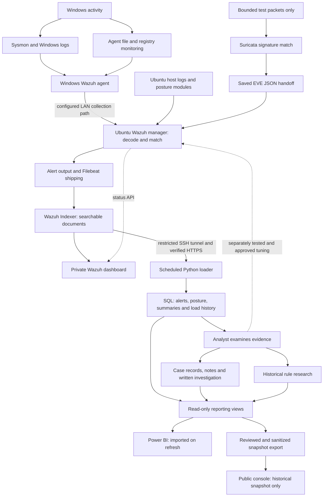

# Triage And System Interaction Audit

October 7, 2026. Read-only source review and bounded live SQL checks, around
21:25 UTC. No alert verdict, case, rule, database schema or service was changed.
This is a review of the current classification path, not a declaration that
every stored event has been investigated or that all live components are healthy.

**Later October 7 update:** the collection repair and exact benign
Sysmon/Indexer/normal-loader SQL trace now pass. See the
[dated repair evidence](collection-health-validation.md). The findings below
retain the original audit's counts/time; case-membership and labeling gaps are
not fixed by repairing the agent connection.

## The Main Distinction

**A rule says what matched. An investigation decides what it means.**

A suspicious-file rule can correctly match a software installer. A benign
installer investigation does not make that rule safe forever. A later event
from a different writer, device or time needs its own evidence.

## Current Interaction Map

The agent-to-manager connection failed at this audit's time; its later repair
is independently verified above. The permanent Suricata service remains masked: the network branch
above describes completed bounded tests and saved-event handoffs, not continuous
capture. See [collection status](collection-health-validation.md) and
[packet-to-report evidence](L0-event-to-report-trace.md).

Tailscale is a private administration/access path, not an event source or a
triage engine. Hyper-V hosts the Ubuntu components; its Default Switch is not a
whole-home traffic mirror. Nmap produces selected test traffic/exposure evidence;
Wireshark/TShark examines available packets. Neither automatically loads results
into SQL. No routine iPhone/browsing coverage is established by this diagram.

The manager performs rule analysis; the Indexer stores/searches results; the
dashboard reads them. The dashboard is not a transport hop between the Indexer
and SQL. Filebeat shipping and the dashboard's separate status API connection
are described in [Wazuh's architecture](https://documentation.wazuh.com/current/getting-started/architecture.html).
Their individual runtime health was not newly tested in this audit.

## What Each Label Means

| Label | Current source | Meaning, and limit |
|---|---|---|
| Source / event type | Collected channel, decoded fields or FIM/module output | Which kind of activity was observed; not its verdict |
| Wazuh rule ID | Manager's matched rule | Which detection condition matched; not a unique event |
| Rule groups | Rule metadata | Families such as Sysmon/FIM/Suricata; not proof of compromise |
| Wazuh level | Alert's stored rule level | Review priority; SQL bands are Low below 7, Medium 7-11, High 12-14, Critical 15 and above |
| ATT&CK technique | Rule's technique tags | Behavior association; not proof of an attack or validated coverage |
| Historical rule review | `sg.rule_triage` | A previous investigation's summary keyed to a rule, not an event-specific judgment |
| Case status / verdict | `sg.cases` plus change history | Human investigation result; current case counts infer membership rather than list exact documents |
| Observation context | `rpt.network_alerts` | Controlled test/replay/unclassified label from saved fields; not a malicious/benign verdict |
| Document identity | Indexer document ID in `sg.alerts` | The link between that Wazuh alert and its SQL row |

Sysmon Event ID 11, Wazuh rule 92213 and Suricata signature 9000001 are different
identifier namespaces. They are not interchangeable. Suricata signature priority
also is not the Wazuh severity scale.

[Wazuh rules](https://documentation.wazuh.com/current/user-manual/ruleset/ruleset-xml-syntax/rules.html)
define levels, groups and match conditions. [MITRE ATT&CK](https://attack.mitre.org/)
provides the behavior vocabulary. Neither replaces analysis of the actual event.

## Verified Findings

### 1. Endpoint Collection Failed At The Audit Time

The fresh SQL check still shows the Windows endpoint's newest retained alert at
10:49:46.056 UTC. Manager records are newer. Earlier independent Indexer/socket
checks establish the disconnection and stale-destination attempt; the protected
administrator diagnostic has since run. Its independently hash/permission-checked
21:29 UTC evidence confirms hostname-based TCP settings, pending state and
repeated stale-address connection errors. The named VM is on the Default Switch,
but its reported IP list is empty. Target identity, authenticated repair and
fresh event flow remain open.

**Consequence:** a quiet Windows dashboard cannot establish safety, and the
rule-library inventory cannot cover events never delivered. Restore collection
and review historical drops before increasing monitoring load.

### 2. Case Membership Is Inferred, Not Exact

`warehouse/cases.py` uses `--since` and `--until` to find the initial alert.
It stores the first alert, rule IDs and an opening note, but not a structured
incident-end boundary or explicit alert membership. `rpt.cases` subsequently
counts every matching-rule alert between first alert and case closure/current
time. It does not constrain that count to an exact device/process/evidence set.

Actual schema/view checks confirm this model. The same rule/time calculation
counts **424 retained alerts in two cases**. Multiple cases can legitimately
share evidence; overlap itself is not fraud or proof that either verdict is
wrong. Here, however, the database cannot distinguish intentional shared evidence
from unrelated events swept into a count by the broad predicate.

**Required improvement:** explicit document-to-case links, an incident window
separate from analyst closure time, and recorded reasons for any shared evidence.
Historical inferred counts must not silently become verified memberships.

### 3. Historical Rule Reviews Can Look Like Technique-Wide Clearance

`rpt.attack_observed` chooses the most frequent rule per technique, then attaches
that rule's historical review. Other rules behind that technique are not rolled
up into the displayed verdict. The console colors technique cards from this
single string and uses unconditional "every one triaged" wording.

Live SQL currently has **43 observed techniques**. **Six** lack a review for
their most frequent rule; **21** have at least one unreviewed fired rule. These
sets can overlap and must not be added as independent totals. The public
snapshot is older: October 3, with 38 techniques, 792 selected alert rows and
15 busiest-rule cards. It is not the current warehouse or a complete alert list.

**Required improvement:** label the display "historical review of the most
frequent rule"; show review completeness and newly observed rules separately.
Green must not imply all activity under that technique is benign.

### 4. Event Verdicts Are Not Automatically Inherited, But Workflow Is Limited

The snapshot exporter deliberately writes `verdict: null` for each alert rather
than copying `sg.rule_triage`. All 792 alerts in the existing snapshot have no
event verdict. `rpt.alerts` also does not join rule research into individual
alert verdicts. The inventory explicitly marks current verdicts unadjudicated.
These safeguards are correct and should remain.

Actual SQL contains 10 cases: nine closed, one open; 147 observed rule IDs, of
which 40 have historical reviews and 107 do not. These are different units:
cases, rule types and individual alerts. None is an individual-alert clearance
rate. The case CLI permits only True positive, Benign or Low risk as closed
verdicts, and a report is optional. It does not provide an event-level review
ledger or structured confidence/evidence sufficiency fields.

**Required improvement:** precise event dispositions and evidence references,
reviewer/time/reason, explicit controlled-test context, and an unresolved path.
Do not close an unexplained event as benign just to empty a queue. A successful
test detection is not a confirmed malicious incident.

### 5. Catalog Readiness And Retention Need Clearer Qualification

The loaded ATT&CK export dates from October 1 and contains 1,062 MITRE-tagged
rules, not every installed rule. `load_attack_catalog.py` marks collected
families by rule filename and marks local rules collected. This does not verify
that every required field/event type is enabled, fresh or sufficient for every
rule. "Rule ready, not fired" is a potential mapping, not installed-engine or
attack-simulation proof. Downloaded ET Open entries also are not deployed coverage.

The loader stores Wazuh alert documents, not all Windows events, PCAPs, DNS
requests or network flows. `rpt.network_alerts` reads fields from `raw_json`.
Under the source's default Low-detail retention policy, that JSON is trimmed
after 365 days; those rows then cease qualifying for the network view. This
audit did not establish a changed live retention setting or run retention.

**Required improvement:** per-rule data prerequisites and validation status,
catalog freshness, and a documented minimal evidence-retention plan. Preserve
necessary case/network evidence privately without retaining all payloads forever.

### 6. Inventory Rejects One Legal Wazuh Level

The reporting views treat levels 15 and above as Critical, but
`inventory_detection_rules.severity()` and the public snapshot validator
currently reject 16. Wazuh documents valid levels 0-16. No level-16 observation
is claimed here; a future legitimate record would stop inventory/publication
rather than categorize it consistently. These source-only edge cases need
focused corrections/tests; no rule severity or privacy check should be weakened
to work around them.

## Existing Tuning: What It Really Does

- **100100:** requires parent 92213, the exact Windows PowerShell executable
  path and the strict policy-test filename in user Temp. It lowers matching
  alerts to level 3; it does not disable the parent rule or prove benign intent.
- **100101:** requires parent 92058, the exact compatibility-maintenance image,
  arguments, parent command line and SYSTEM user. It likewise preserves a
  lower-level alert, with spoofing/compromised-process risk still possible.
- **100110-100113:** raise selected secret-file, scheduled-script and startup
  changes for review. They do not establish credential theft or persistence
  merely because a path changed. The Edge startup case cleared its investigated
  change, not every future Run-key change.
- The proposed filename-only expansion is held, not deployed. Its writer/path
  and negative-control gate remains in the [tuning review](powershell-policy-probe-tuning-review.md).

Closing a SQL case does not modify a Wazuh rule. Editing a Markdown investigation
does not automatically update case/rule-research tables. Deploying a tuned child
rule affects future manager matches, not the severity stored on old SQL alerts.

## Two Worked Examples

**PowerShell policy-test file:** Windows records a file creation; the agent
forwards it; Wazuh decodes the writer/path and evaluates the parent and any
matching child rule. The Indexer stores the resulting alert, and the loader
copies that document and original severity to SQL. The analyst checks process,
path, timing and related events. Only reviewed evidence supports a case verdict.
An unrelated writer creating the same-looking filename remains a new question.

**Suricata marker test:** a captured ICMP request contains the marker required by
signature 9000001. Suricata produces EVE JSON; the saved handoff produces Wazuh
rule 86601 at level 3. The Indexer/SQL record links to the original packet time
and private capture evidence. The network view labels its validation context;
the label alone is not evidence authentication. Power BI shows its imported data
only after refresh. [EVE can contain several telemetry types](https://docs.suricata.io/en/suricata-8.0.7/output/eve/eve-json-output.html);
our current network reporting view selects alerts, not all those types.

## A Triage Routine We Can Defend

1. Check collection health and report freshness before interpreting silence.
2. Select an exact alert or explicitly scoped cluster; record identity, device
   and time bounds, not just the rule number.
3. Identify behavior/source, severity and ATT&CK tags separately.
4. Gather corroboration: writer/parent/user/path, signatures and permissions,
   related endpoint events, change records or available packet evidence.
5. Record expected activity, controlled validation, suspicious/unresolved or
   confirmed malicious, with reason, confidence and evidence limitations.
6. Link the exact evidence to a case where an investigation is warranted; do not
   manufacture a case for every routine record or equate volume with attacks.
7. Tune only a reviewed recurring pattern, with engine positives/nonmatches,
   protected rollback and a measured future window. Preserve important signals.
8. Verify SQL/Power BI/console labels tell the same scoped story and respect
   evidence retention/privacy. Publish only sanitized, reviewed conclusions.

Items such as event dispositions, explicit memberships and confidence fields
above are proposed improvements, not capabilities credited to the current schema.

## Finish Gates In The Existing Plan

- [x] Restore and verify the current outage's Windows collection (Stages 2-4);
  later repair/source/Indexer/SQL proof is separate from this original audit.
- [ ] Review earlier drops, reboot durability and actual source-health signals.
- [x] Correct misleading public-console rule/technique labels without assigning
  new verdicts; existing Power BI changes/rendering remain separate below.
- [x] Correct/test level-16 inventory, snapshot-schema and console handling.
- [ ] Design/test exact case membership and evidence-backed dispositions;
  separately approve and back up any live schema migration (Stage 7).
- [ ] Reconcile historical cases deliberately; do not auto-backfill memberships
  from the same broad rule/time predicate.
- [ ] Show the new scoped fields in the existing reporting surfaces and actually
  refresh/check Power BI when the PC is available (Stage 8).
- [ ] Validate data prerequisites, retention and a small TCP library batch;
  then resume bounded Nmap/network learning (Stage 5).

This audit does not classify all 37,656 retained alerts, endorse all existing
historical judgments, deploy detection libraries or close the collection gate.

## Audit Evidence And Limits

Checked [case selection](../warehouse/cases.py), [deployed case-count logic](../warehouse/sql/09_cases.sql),
[technique rollup and historical research](../warehouse/sql/07_attack_coverage.sql),
[report views](../warehouse/sql/03_reporting_views.sql), [network projection](../warehouse/sql/11_network_reporting.sql),
[retention](../warehouse/sql/05_lifecycle.sql), [source-family mapping](../warehouse/load_attack_catalog.py),
[inventory classification](../warehouse/inventory_detection_rules.py),
[console labels](../console/app.js), local tuning/FIM rules, and report/model
builders. The private snapshot exporter/validator were also inspected without
running an export. Live SQL schema/view metadata and aggregate queries confirm
the counts and membership limits above; no raw event payload was published.

Ninety-three existing focused checks passed: 43 reliability/library, 33
publication-privacy and 17 diagnostic-helper checks. They do not prove the
identified design gaps are fixed or that every historical verdict is justified.
No actual Power BI refresh, new packet capture, engine replay, rule deployment,
case write or live SQL migration was performed. The three actual administrator
diagnostic files have independently matching hashes and private reader grants.

## Reporting Correction Follow-Up

The later [repository review](repository-review.md) implements the two checked
gates above. Public rule/technique labels now say historical review; case counts
say inferred rule/time matches. These edits neither assign new event verdicts
nor reconcile historical cases. All five console views pass real, nullable,
empty and level-16 snapshot checks on desktop and mobile. Missing timing remains
unavailable in the exporter and UI. The installed database/rules and the existing
six-page Power BI definitions were not changed by this correction batch.
